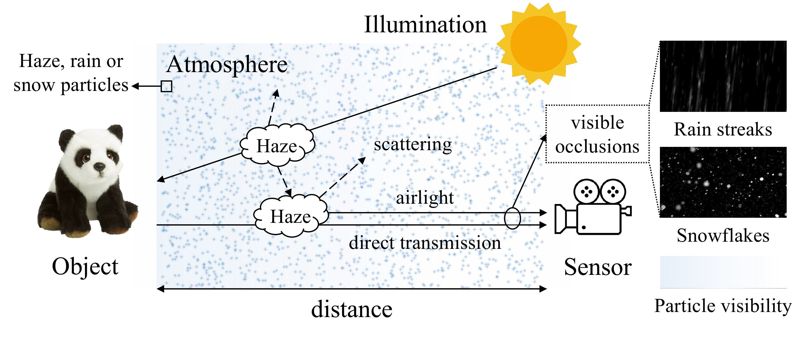

# WeatherNet

You can download our **Weather30K** dataset [here](https://appsrv.cse.cuhk.edu.hk/~jqxu/data/WeatherNet/Weather30K.zip) or [here](https://huggingface.co/datasets/jiaqixuac/Weather30K/blob/main/Weather30K.zip).
The dataset includes images with mixed haze, rain, and snow conditions, generated based on visible occlusions and scattering effects.

## License

This project is released under the [MIT license](./LICENSE).
